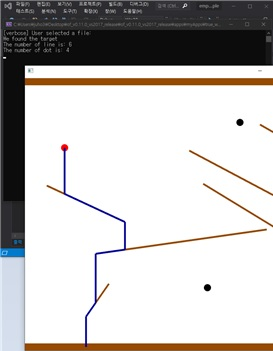

# Computer experiment lecture in 2020-2 semester

## Summary

- `3 lessons`
  - **Unix** - week1, week2
  - **Cpp** - week3, week4
  - **GitHub** - week 5
- `3 projects`
  - **Tetris** Projects - week6, week8, week9
  - **Waterfall** Projects - week10, week11
  - **Maze** Projects - week12, week13, week14

ㅤ

ㅤ

## **Unix** - week1, week2

   

    

=> shell programming practice

ㅤ

## Tetris Projects - week6, week8, week9

### Basic operation 

ㅤ

### Rank system

ㅤ

### Recommand system

=> Look up for 4 depth states and Recommand block position to put on.

ㅤ

## **Waterfall** Projects - week10, week11

ㅤ

ㅤ

## **Maze** Projects - week12, week13, week14

### make maze

ㅤ

### draw maze

=> Read text a text file (rhs) and show on program (lhs).

ㅤ

### dfs vs bfs maze search

=> Gray areas indicate visited locations. `dfs search` can give direction to navigation.